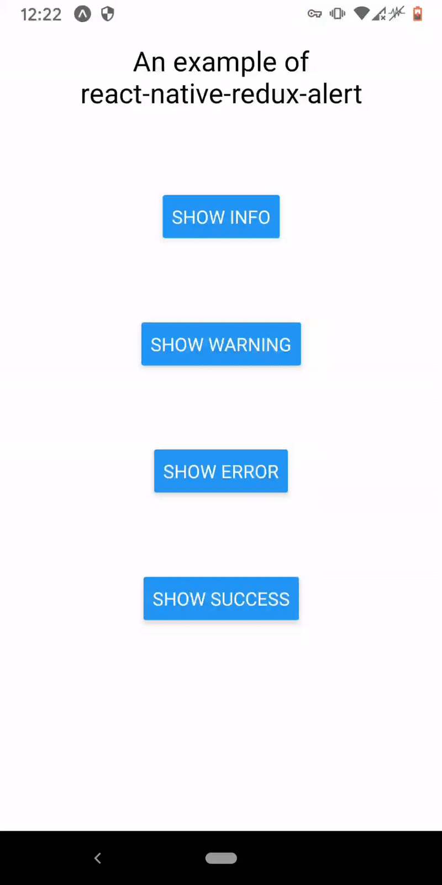

# react-native-redux-alert
A Redux based toast message provider crafted for React Native.

## Features
 - 100% written in JS, thus makes it compatible both with Expo and pure React Native.
 - Simple, easy to set up and use.
 - Customisable.

## Demo


## Installation
```bash
$ npm install --save react-native-redux-alert
```

### Peer dependencies
This package expect the following peer dependencies:
```
  "react": "^17.0.2"
  "react-native": "^0.64.1"
  "react-redux": "^7.2.4"
  "redux": "^4.1.0"
```

So make sure that you have those installed too!

## Usage
First you have to add the `alertReducer` to your store:
```js
import { createStore, combineReducers } from 'redux'
import { alertReducer } from 'react-native-redux-alert'

const reducers = combineReducers({
  alertReducer,
})

export default createStore(reducers)
```

Then mount the Alert into the component where you're going to use it - usually it's the root component:
```js
import React from 'react'
import { Provider } from 'react-redux'
import { SafeAreaView } from 'react-native'
import { Alert } from 'react-native-redux-alert'

import store from './src/redux/store'
import Home from './src/Home'

const App = () => (
  <Provider store={store}>
    <SafeAreaView style={{ flex: 1 }}>
      <Home />
      <Alert />
    </SafeAreaView>
  </Provider>
)
```

That's all! Easy, right? Next you are able to call the toast messages by dispatching the appropriate action, like on this example:
```js
import React from 'react'
import { Button, View } from 'react-native'
import { actions } from 'react-native-redux-alert'

const Home = ({ dispatch }) => {
  const warningHandler = () => {
    dispatch(actions.showWarning('A warning message!', 2500))
  }

  return (
    <View>
      <Button title={'Warn'} onPress={warningHandler} />
    </View>
  )
}
```

## API
### Alert component
`react-native-redux-alert` provides several API's, one of them is the Alert component.\
It's the component which displays the toast messages you're passing into actions, hence why it should be always placed in the project's root.

#### Alert's props
 - `containerStyles` <`object`>: the styles, which are applied to Alert's container.
 - `textStyles` <`object`>: the styles, which are applied to the text, show in the Alert box.
 - `iconStyles` <`object`>: the styles, which are applied to icon inside the container.
 - `useNativeDriver` <`bool`>: whether `useNativeDriver` should be applied to the Aminations or not, default: `true`.
 - `showIcon` <`bool`>: should the icon be displayed near the text or not, default: `true`.
 - `transition` <`'fade'`>: the transition animation type. Currently `fade` is the only one supported.
 - `animated` <`bool`>: whether Alerts should be animated or not, default: `true`.

### Actions
Currently, there are 5 actions available: 1 base action - `show`, and 4 actions which are basically the aliases for it: `showError`, `showSuccess`, `showWarning` and `showInfo`.

#### show params
 - `message` <`string`>: the message to display.
 - `duration` <`number`>: how long should message be displayed in milliseconds, default: `5000`.
 - `type` <`'info' | 'success' | 'warning' | 'error'`> - the type of the message, default: `info`.

### aliases params
 - `message` <`string`>: the message to display.
 - `duration` <`number`>: how long should message be displayed in milliseconds, default: `5000`.

### types and transitions
`react-native-redux-alert` provides objects which specify what options are supported by the Alert component.
 - `types` object contains information about the types of messages supported.
 - `transitions` object contains information about the transitions supported by the Alert component.

## Contributing
1. Fork it
2. Create your feature branch (`git checkout -b feature/my-cool-feature`)
3. Make sure your code complies with ESLint (`npm run lint`)
4. Commit your changes (`git commit -m 'Added XXX'`)
5. Push to the branch (`git push -u origin feature/my-cool-feature`)
6. Create a new Pull Request

## Licence
The project is licenced under the [MIT Licence](LICENSE).
```
MIT License

Copyright (c) 2021 Andrii R.

Permission is hereby granted, free of charge, to any person obtaining a copy
of this software and associated documentation files (the "Software"), to deal
in the Software without restriction, including without limitation the rights
to use, copy, modify, merge, publish, distribute, sublicense, and/or sell
copies of the Software, and to permit persons to whom the Software is
furnished to do so, subject to the following conditions:

The above copyright notice and this permission notice shall be included in all
copies or substantial portions of the Software.

THE SOFTWARE IS PROVIDED "AS IS", WITHOUT WARRANTY OF ANY KIND, EXPRESS OR
IMPLIED, INCLUDING BUT NOT LIMITED TO THE WARRANTIES OF MERCHANTABILITY,
FITNESS FOR A PARTICULAR PURPOSE AND NONINFRINGEMENT. IN NO EVENT SHALL THE
AUTHORS OR COPYRIGHT HOLDERS BE LIABLE FOR ANY CLAIM, DAMAGES OR OTHER
LIABILITY, WHETHER IN AN ACTION OF CONTRACT, TORT OR OTHERWISE, ARISING FROM,
OUT OF OR IN CONNECTION WITH THE SOFTWARE OR THE USE OR OTHER DEALINGS IN THE
SOFTWARE.
```
